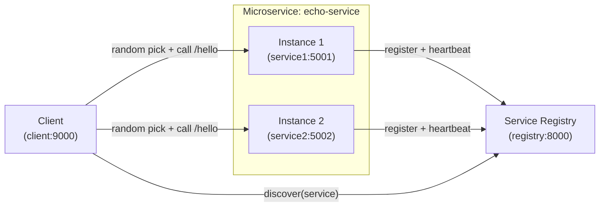

# Microservice Discovery (Registry + 2 Instances + Client)

This project implements the required flow:

- **2 service instances** (`service1` + `service2`) run on **different ports** and register themselves
- A **service registry** stores active instances (with TTL + heartbeats)
- A **client service** discovers instances from the registry and calls a **random** instance (no hardcoded instance address)

## Architecture diagram



## Quick start (Docker Compose)

From this folder:

```bash
docker compose up --build
```

## How to test (end-to-end)

Make sure everything is running first:

```bash
docker compose up --build
```

### Step 1: Verify registry is running

```bash
curl -s http://localhost:8000/health
```

Expected:

```json
{"status":"ok"}
```

### Step 2: Verify both service instances are running

```bash
curl -s http://localhost:5001/health
curl -s http://localhost:5002/health
```

Expected:

- One returns something like:

```json
{"status":"ok","service":"echo-service","instance_id":"echo-1"}
```

- The other returns something like:

```json
{"status":"ok","service":"echo-service","instance_id":"echo-2"}
```

### Step 3: Verify services registered with the registry

```bash
curl -s http://localhost:8000/discover/echo-service
```

Expected:

- `"count": 2`
- both instances listed (including `echo-1` and `echo-2`)

This proves services successfully registered with the registry.

### Step 4: Test direct service responses

```bash
curl -s http://localhost:5001/hello
curl -s http://localhost:5002/hello
```

Expected:

- Both return valid JSON
- Each shows a different `instance_id` (`echo-1` vs `echo-2`)

### Step 5: Test client-based service discovery (IMPORTANT)

Run this multiple times:

```bash
curl -s "http://localhost:9000/call?service=echo-service&path=/hello"
```

Now run the loop.

Mac/Linux:

```bash
for i in {1..10}; do
  curl -s "http://localhost:9000/call?service=echo-service&path=/hello"
  echo
done
```

Windows PowerShell:

```powershell
for ($i=1; $i -le 10; $i++) {
  curl "http://localhost:9000/call?service=echo-service&path=/hello"
}
```

### Step 6: Verify random load balancing

Expected:

- Some responses show `"chosen_instance_id": "echo-1"`
- Some show `"chosen_instance_id": "echo-2"`

This proves the client discovers the service and randomly selects an instance.

### Step 7: Failure / resilience test (very important)

Stop one service instance:

```bash
docker stop service2
```

Wait ~15–20 seconds (TTL expiry; default TTL is 15 seconds).

Then check:

```bash
curl -s http://localhost:8000/discover/echo-service
```

Expected:

- `"count": 1`
- only one instance remains

Now call the client again:

```bash
curl -s "http://localhost:9000/call?service=echo-service&path=/hello"
```

Expected:

- still works
- always returns the remaining instance (typically `echo-1`)

This proves the registry removes dead instances and the system still works.

### Step 8: Negative test (optional but good)

Unknown service:

```bash
curl -i "http://localhost:9000/call?service=unknown&path=/hello"
```

Expected:

- HTTP `503` response

What you just proved (tie to assignment)

- 2 service instances running
- services register with registry
- client discovers service dynamically
- client calls a random instance
- system handles failure correctly

### Verify registry has 2 instances

```bash
curl -s http://localhost:8000/discover/echo-service | python -m json.tool
```

You should see `"count": 2` and both `echo-1` and `echo-2`.

### Call a random instance via the client

```bash
curl -s "http://localhost:9000/call?service=echo-service&path=/hello" | python -m json.tool
```

Run it a few times and watch `chosen_instance_id` flip between `echo-1` and `echo-2`.

### One-command demo loop

```bash
./scripts/demo.sh
```

## Endpoints

### Registry (`registry:8000`)

- `POST /register` – register/update an instance
- `POST /heartbeat/{service}/{instance_id}` – refresh TTL
- `GET /discover/{service}` – list active instances

### Service instances (`service1:5001`, `service2:5002`)

- `GET /hello` – returns instance identity

### Client (`client:9000`)

- `GET /call` – discovers instances and calls one randomly
