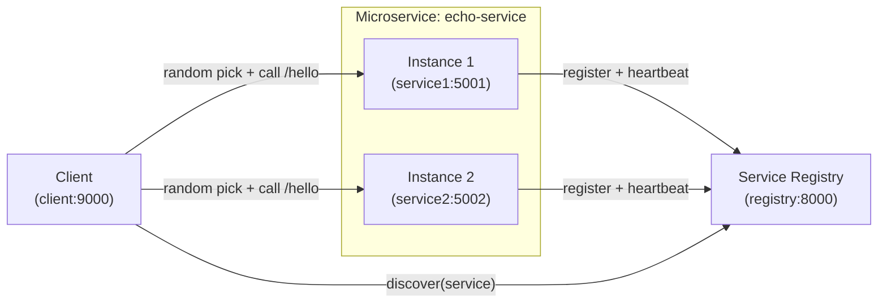

# Microservice Discovery (Registry + 2 Instances + Client)

This project implements the required flow:

- **2 service instances** (`service1` + `service2`) run on **different ports** and register themselves
- A **service registry** stores active instances (with TTL + heartbeats)
- A **client service** discovers instances from the registry and calls a **random** instance (no hardcoded instance address)

## Architecture diagram



## Quick start (Docker Compose)

From this folder:

```bash
docker compose up --build
```

### Verify registry has 2 instances

```bash
curl -s http://localhost:8000/discover/echo-service | python -m json.tool
```

You should see `"count": 2` and both `echo-1` and `echo-2`.

### Call a random instance via the client

```bash
curl -s "http://localhost:9000/call?service=echo-service&path=/hello" | python -m json.tool
```

Run it a few times and watch `chosen_instance_id` flip between `echo-1` and `echo-2`.

### One-command demo loop

```bash
./scripts/demo.sh
```

## Endpoints

### Registry (`registry:8000`)

- `POST /register` – register/update an instance
- `POST /heartbeat/{service}/{instance_id}` – refresh TTL
- `GET /discover/{service}` – list active instances

### Service instances (`service1:5001`, `service2:5002`)

- `GET /hello` – returns instance identity

### Client (`client:9000`)

- `GET /call` – discovers instances and calls one randomly
