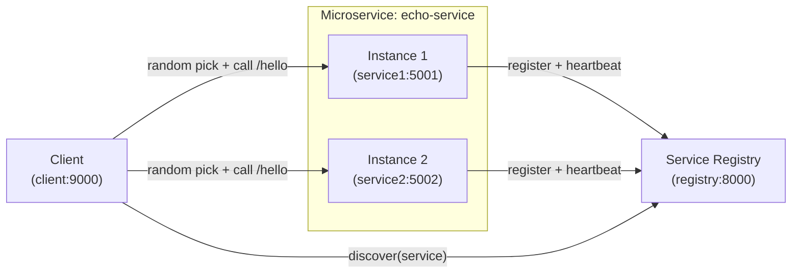

## Architecture (Discovery Flow)

```mermaid
flowchart LR
  subgraph Services["Microservice: echo-service"]
    S1["Instance 1\n(service1:5001)"]
    S2["Instance 2\n(service2:5002)"]
  end

  R["Service Registry\n(registry:8000)"]
  C["Client\n(client:9000)"]

  S1 -- "register + heartbeat" --> R
  S2 -- "register + heartbeat" --> R
  C  -- "discover(service)" --> R
  C  -- "random pick + call /hello" --> S1
  C  -- "random pick + call /hello" --> S2
```
