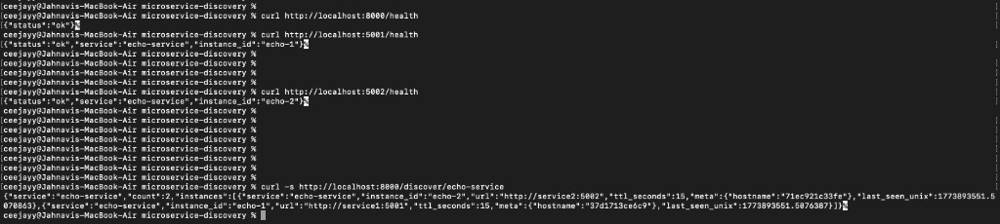
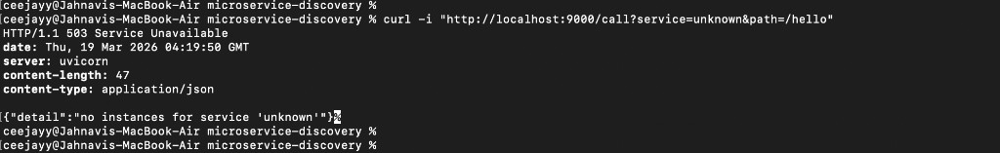
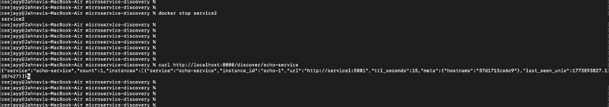
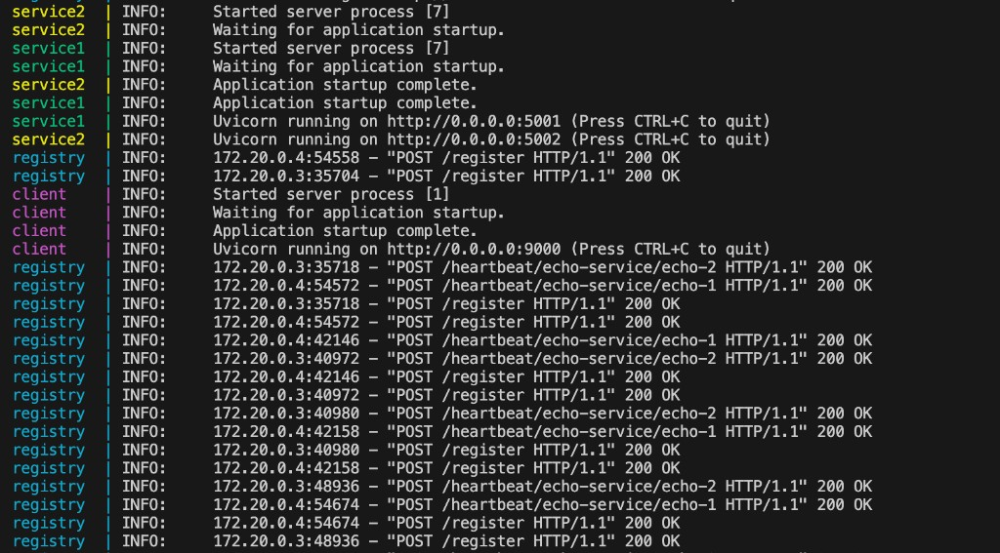
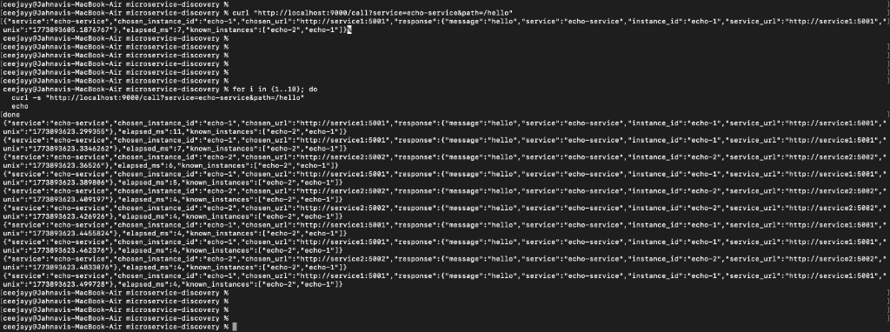

# Testing (End-to-End)

This document contains screenshots demonstrating the end-to-end testing of the service registry, two service instances, and the client-based discovery + load balancing.

## Screenshots

### Health checks and discovery (registry + instances)

### Negative test (unknown service returns 503)

### Failure / resilience test (stop one instance, TTL expiry)

### Registry heartbeats / runtime logs

### Test client-based service discovery and Verify random load balancing

